# The data layer

What is stored, who writes it, what each column means, and how a stored value is allowed to be
read. The companion document — [`metric-catalogue.md`](./metric-catalogue.md) — takes every
number on screen and names the arithmetic behind it, plus the places where that arithmetic is
currently wrong or misleading.

Three rules govern the whole layer and are repeated here because every table obeys one of them:

1. **Money is an integer.** Postgres `numeric` round-trips as a string and floats drift, so every
   dollar is `bigint` **nano-dollars** (USD × 1e9). The GitHub billing CSVs carry nine decimals and
   LiteLLM reports per-request spend near 1e-8 USD, so cents are not enough. Conversion to dollars
   happens exactly once, at the API response edge (`nanoToDollars`).
2. **Absence has three different meanings, and each table declares which one it uses.** *Unknown*
   (Copilot per-user metrics, gateway budget limits, catalogue prices) — nullable, rendered `—`,
   never zero-filled. *Zero* (gateway usage counters, per-day org activity) — the source omits what
   never happened, so no row is a real zero. *Unread* (every gateway history/sample table) — a day
   with no row is a day nobody looked, and nothing may be interpolated into it.
3. **Slices of one total may not be added together.** The gateway breakdown dimensions and the
   Copilot billing reports both overlap by construction. Sums are always taken *within* one
   dimension, with the denominator taken from the gateway-wide or report-wide total.

---

## 1. Relation map

There are no foreign keys anywhere in the schema. That is deliberate: imports and syncs arrive in
any order, a login can be billed before the roster names it, and the identity join is done in code
at read time. The lines below are **logical** joins.

```mermaid
erDiagram
    COPILOT_SEATS   ||--o{ USER_DAILY       : "login (purged on refresh)"
    GITHUB_USERS    ||--o| JIRA_PEOPLE      : "saml_name_id (case-insensitive)"
    GITHUB_USERS    ||--o{ BILLING_DAILY    : "login"
    GITHUB_USERS    ||--o{ MODEL_SPEND_DAILY: "login"
    GITHUB_USERS    ||--o| COPILOT_SEATS    : "login"
    ORG_DAILY       ||--o{ USAGE_BREAKDOWN_DAILY : "date"
    ORG_DAILY       ||--o{ ADOPTION_PHASE_DAILY  : "date"
    ORG_DAILY       ||--o{ MODEL_DAILY           : "date"
    GATEWAY_DAILY   ||--o{ GATEWAY_BREAKDOWN_DAILY : "date"
    GATEWAY_DAILY   ||--o{ GATEWAY_MONTH           : "month rollup (sealed)"
    GATEWAY_MONTH   ||--o{ GATEWAY_MONTH_LINE      : "month + revision"
    GATEWAY_MODEL   ||--o{ GATEWAY_DEPLOYMENT_HEALTH : "resolved alias"
    GATEWAY_DEPLOYMENT_HEALTH ||--o{ GATEWAY_DEPLOYMENT_HEALTH_HISTORY : "id + date"
    GATEWAY_BUDGET  ||--o{ GATEWAY_BUDGET_HISTORY : "scope + key + date"
    GATEWAY_BUDGET  ||--o{ GATEWAY_NOTIFICATION    : "fingerprint kind:scope:key"
    GATEWAY_EXCEPTION_SWEEP ||--o{ GATEWAY_EXCEPTION_DAILY : "date (receipt)"
    OTLP_METRIC_POINTS ||--o{ OTLP_LOG_RECORDS : "session_id / user_email (unused today)"
```

Two joins are load-bearing and easy to miss:

- **`github_users` is the identity spine.** `login → saml_name_id → jira_people` gives every seat
  and every billing row its display name, department and two manager levels. Either hop may miss;
  the row still counts in every total and renders `mapped: false`.
- **`gateway_deployment_health.model` is *resolved*, not fetched.** `/health` reports routing
  strings, so the sync joins them against the catalogue it fetched in the same run. A null means no
  catalogue row claimed the deployment, never a near-match.

---

## 2. What fills what

Seven independent writers. Five are scheduled at **07:00 Europe/Prague** by an in-process timer
(`scheduler.ts`), each a distinct `refresh_jobs.kind`, single-flight per kind (partial unique
index), safe to run concurrently. Two are push/upload paths with no schedule.

| # | Writer | Kind | Source | Window | Write mode | Tables |
|---|--------|------|--------|--------|-----------|--------|
| 1 | `services/refresh.ts` | `copilot` | seats API + `users-28-day` + `organization-1-day` reports | 90 days back from the newest settled report day | seats upsert-then-delete-missing; daily tables **delete-then-insert per fetched day** | `copilot_seats`, `org_daily`, `usage_breakdown_daily`, `adoption_phase_daily`, `user_daily`, `model_daily` |
| 2 | `services/billing-sync.ts` | `billing` | `/enterprises/{slug}/settings/billing/ai_credit/usage?user=` | **yesterday + the day before only** | delete-then-insert those days (`billing_daily` only loses its `copilot_ai_credit` rows) | `billing_daily`, `model_spend_daily`, `github_users.active` |
| 3 | `services/billing-import.ts` | — (upload) | Report 1 / Report 2 CSV | whatever the file covers | upsert by PK, all-or-nothing per file | same as #2, plus `import_logs` |
| 4 | `services/members-sync.ts` | `members` | GraphQL `samlIdentityProvider.externalIdentities` | full org roster | upsert; **never deletes, never touches `active`**; saml id via `coalesce(excluded, existing)` | `github_users`, `import_logs` |
| 5 | `services/jira-sync.ts` | `jira` | JIRA Insight batch | full people set | upsert by saml id | `jira_people` |
| 6 | `services/gateway-sync.ts` | `gateway` | LiteLLM proxy, 9 route families | **90 days ending yesterday UTC** (today excluded — still accruing) | usage: replace the fetched days. Snapshots (budget, model, health): replace wholesale. Histories/sweeps: append one day | 16 `gateway_*` tables |
| 7 | `otlp/ingest.ts` | — (push) | OTLP/HTTP JSON from Claude Code | continuous | append-only | `otlp_metric_points`, `otlp_log_records` |

### The mode distinctions that matter

- **Per-day delete-then-insert (not upsert)** on `usage_breakdown_daily`, `adoption_phase_daily`,
  `user_daily`, `model_daily`, `gateway_daily`, `gateway_breakdown_daily`: the key set for a day can
  *shrink* between refreshes (a model retired, a phase emptied). An upsert would leave the stale key
  standing and double-count it in the next roll-up. Days the fetch returned nothing for keep their
  stored rows, so a report outage cannot erase history.
- **`keepIfNull` on the seat upsert.** `name`, `plan`, `last_activity_at` and `team` always
  overwrite (GitHub is authoritative). `editor`, `language`, `premium_requests_28d`,
  `acceptance_rate`, `used_agent`, `used_chat`, `top_model` overwrite **only when the incoming value
  is non-null**, so CSV-imported enrichment survives a live sync that reports them as null.
- **A ranged gateway sync (`?from=&to=`) writes only usage.** Budgets, the catalogue, `/health`, and
  all three per-alias sweeps are skipped: governance is a snapshot of the proxy *now*, and the three
  sweeps read the request/error logs, which are pruned on their own schedule. Repairing six days in
  May must not overwrite tonight's governance or file whatever survived pruning as May's readings.
- **The month seal is never implicit.** A full sync seals a closed month whose every day is stored;
  a backfill deliberately does not. Re-sealing adds a `revision` and stamps the previous one
  `superseded_at`; a partial unique index keeps exactly one current statement.

### Ordering caveat

The scheduler fires the five syncs in order but does **not** await them: `startJob` returns as soon
as the row is inserted and runs the body detached. So `members-sync` being listed before `jira-sync`
buys nothing — a login that joins today gets its department tomorrow.

---

## 3. Column dictionary

Only columns whose meaning is not obvious from the name are annotated. `synced_at` /
`observed_at` / `checked_at` are everywhere and always mean "when this row was written", defaulting
to `now()`.

### 3.1 Copilot usage

#### `copilot_seats` — PK `login`
Current roster. A snapshot, not a history: a refresh deletes every login the snapshot did not carry.

| Column | Filled by | Meaning & treatment |
|---|---|---|
| `login` | seats endpoint `assignee.login` | The stable identity. Joins `github_users`, `user_daily`, `billing_daily`. |
| `name` | `assignee.name` else login | Roster name; the *display* name comes from the JIRA join instead. |
| `plan` | `plan_type` | `business`/`unknown` → `Business`, `enterprise` → `Enterprise`. **Unknown is billed as the lower plan.** |
| `editor` | `last_activity_editor`, then overridden by the dominant IDE in the users report | Free-form string mapped onto a closed 5-value union; anything unrecognised is `null`. |
| `language` | dominant `totals_by_language_model.language` weighted by generations | Free-form (GitHub emits dozens). Null when nothing is attributed. |
| `last_activity_at` | seats endpoint | **Stored as a timestamp**; the "days ago" the UI shows is derived at read time so it never goes stale. Null = never used. |
| `premium_requests_28d` | `ai_credits_used` summed over the 28-day users report, rounded | **This is AI credits, not premium requests** — see finding F1. Null on a live org with no report. |
| `acceptance_rate` | `round(acceptances ÷ generations × 100)` over the 28-day window | Null when generations = 0. Integer percent. |
| `used_agent` / `used_chat` | OR-reduced across the window's rows | Nullable tri-state. |
| `top_model` | dominant `totals_by_model_feature` (weight = interactions + generations), falling back to `totals_by_language_model` | The fallback matters: `model_feature` covers chat/agent, `language_model` only code completions. |
| `team` | `assigning_team.name` | Null when the seat was assigned directly. |

#### `org_daily` — PK `date`
One row per calendar day from `organization-1-day`. Every column is `not null` and **zero-filled at
parse time** (`?? 0`) — the org report covers every day, so absence there is a real zero. The
columns added later (`loc_suggested_*`, `chat_mau`, `agent_mau`, `code_review_*`, `cloud_agent_*`,
`pr_*`) carry `default 0` so rows synced before those migrations read as zeros rather than nulls.
`daily/weekly/monthly_active_users` are GitHub's own DAU/WAU/MAU, not derived here.

#### `usage_breakdown_daily` — PK `(date, dimension, key)`
One generic table for four dimensions instead of four tables, because the shape and the UI treatment
are identical.

| Column | Meaning |
|---|---|
| `dimension` | `ide` \| `language` \| `feature` \| `model`. |
| `key` | Free-form, lowercase, as GitHub emits it (`vscode`, `python`, `chat_panel_agent_mode`, model ids). GitHub's noise buckets (`others`, `unknown`, `none`, empty) are **dropped at parse time**, so the dimension does not sum to the org total. |
| metric columns | Summed across the composite arrays: `language` comes from `totals_by_language_model`, `model` from `totals_by_model_feature`. |

#### `adoption_phase_daily` — PK `(date, phase_number)`
GitHub's AI-adoption cohorts. **Every metric except `engaged_users` is already an average** (`avg_*`,
`doublePrecision`) — averages per engaged user, which is why nothing on the page sums them.

#### `user_daily` — PK `(date, login)`
Per-seat daily activity — the only thing that lets the usage charts follow the seat filters.
`interactions` and all four LOC columns exist **only inside the per-IDE totals** of the users report
and are summed across a row's IDE entries; `generations`/`acceptances` are top-level with the IDE sum
as fallback. Coverage differs by source: the mock fills the whole history, live GitHub only fills
what the users report exposes (its trailing 28-day window), so older days simply have no rows. A
login missing from the roster is purged here on every refresh.

#### `model_daily` — PK `(date, model)`
`totals_by_language_model` collapsed to one row per model, summed across languages. Separate from
`usage_breakdown_daily`'s `model` dimension, which is built from `totals_by_model_feature` — **the
two disagree on purpose** and answer different questions (code-only vs. all features).

### 3.2 Money

#### `billing_daily` — PK `(date, login, sku)` — **the sole money authority**

| Column | Filled by | Meaning & treatment |
|---|---|---|
| `sku` | CSV `sku`, or `SKU_MAP` on the API path | Validated against `BILLING_SKUS` (`copilot_ai_credit`, `copilot_for_business`, `copilot_premium_request`). Kept `varchar`, not an enum, so an unknown sku fails loudly at import instead of needing a migration to be named. |
| `quantity_nano` | CSV `quantity` / API `grossQuantity` × 1e9 | Credits **or** user-months depending on the sku — the unit is the sku's, so the column is never summed across skus. |
| `gross_nano` / `discount_nano` / `net_nano` | CSV columns / API amounts × 1e9 | `net = gross − discount`, as the source states it; nothing recomputes it. |

Raw files repeat a key across cost centres and repositories; the parser **sums** those into one row
rather than letting the last one win. Licence accrual (`copilot_for_business`) has no per-user API
and is CSV-only — the daily sync can never produce it.

#### `model_spend_daily` — PK `(date, login, model)` — statistics, never money
Report 1. Overlaps Report 2's AI-credit money by construction, so it is **never summed into money
totals**. Only `copilot_ai_credit` rows land; `copilot_premium_request` rows carry a *request count*
at a different unit price and are skipped and counted. `credits_nano` is the AI-credit quantity ×
1e9.

### 3.3 Identity

#### `github_users` — PK `login`
| Column | Meaning |
|---|---|
| `saml_name_id` | Nullable — blank in the export, or an unlinked member. Written through `coalesce(excluded, existing)` by the member sync, so an unknown never erases what an upload established. A nameId longer than the `varchar(40)` column is **skipped and counted, never truncated** (a truncated id joins to the wrong person). |
| `active` | **Sticky.** Set true the first time a login appears in a billing report; never cleared, and the member sync never touches it. It means "seen in a billing report", not "employed" — so it gates the spend page's people list and must never gate seat identity. |

Rows are never deleted. A login that leaves the org, unlinks SSO, or falls out of a partial page are
three indistinguishable states from one response.

#### `jira_people` — PK `saml_name_id` (stored uppercase, matched case-insensitively)
`b1_manager` / `b2_manager` are `referencedObject.label` verbatim.

### 3.4 Gateway — usage

#### `gateway_daily` — PK `date`, and `gateway_breakdown_daily` — PK `(date, dimension, key)`
Both carry the same nine counters. Money is nano-dollars; token counters are `bigint` because a
corporate gateway clears int32 in one busy day. **Every counter is non-null**: the proxy omits what
never happened, so zero here is a fact.

| Column | Treatment |
|---|---|
| `dimension` | `model`, `provider`, `api_key`, `mcp_server`, `user`, `team`, `tag`. Six re-slice the same dollar; `mcp_server` is a **strict subset**. Never sum across dimensions. |
| `key` | The raw id the proxy reports (hashed key tokens, user ids — hence 200 chars). |
| `label` | The alias the proxy resolved; null renders `—`. Ranking takes the first non-null label seen for a key. |
| `prompt_tokens` | **The whole input.** `cache_read_tokens` and `cache_creation_tokens` are *subsets* of it (`CACHE_TOKENS_INSIDE_PROMPT_TOKENS`). Nothing may add a cache counter to it to build an input total, and nothing may price it at the full input rate without taking both counters back out. |
| `successful_requests` / `failed_requests` | The ledger's own counts; the exception layer's totals are allowed to disagree with them. |

### 3.5 Gateway — governance

#### `gateway_budget` — PK `(scope, key)` — snapshot, replaced wholesale
The one gateway table with no date column: a budget is configuration plus the proxy's enforced
counter, and the proxy is the system of record for both.

| Column | Treatment |
|---|---|
| `spend_nano` | The proxy's **enforced** counter for the period in flight. Never re-derived from `gateway_daily` — a key's period resets on its own schedule, and the enforced number is the one that refuses calls. For `scope = 'tag'` it is cumulative since creation whatever the duration says (LiteLLM has no tag reset handler, BerriAI/litellm#27481) — read it through `budgetCounterResets(scope)`. |
| `max_budget_nano`, `soft_budget_nano`, `tpm_limit`, `rpm_limit` | **Null means no such limit; `0` means reject everything.** Never zero-filled. This is the one place in the gateway schema where absence is unknown-shaped. |
| `budget_duration` | LiteLLM duration string (`30d`, `1mo`, `24h`). Parsed to derive `periodStart = resetAt − duration`. |
| `blocked` | Explicit disable, outranking any percentage. |

Governed **users** are a deliberate subset: only rows carrying an actual limit, budget link or block
are stored, because a user row is created the first time somebody signs in — an uncapped one is a
person, not a decision. Keeping them all would put the staff directory in this table and report ~0%
governance coverage for a reason that is arithmetic. Dynamic tags (ones the proxy merely saw in spend
data) are dropped for the same reason.

#### `gateway_budget_history` — PK `(scope, key, date)` — **a sample, not a series**
One reading per governed object per UTC day, keyed on the *day* so a second sync the same afternoon
replaces it. Written by full syncs only. A day with no row is a day nobody looked — not zero, not
"unchanged" — so nothing derived from it may be interpolated, and a period total read off it is a
floor. `label` is the alias as it read that day, so a rename is itself a recorded change.

#### `gateway_notification` — PK `fingerprint`
| Column | Treatment |
|---|---|
| `fingerprint` | `kind:scope:key`, **carrying no numbers**. A counter climbing further is the same episode; an escalation (`soft` → `over`) changes the kind and is a new one. |
| `source` | `budget` or `health` — recorded rather than inferred, because it scopes the close pass: a source that could not be read closes nothing. An unread table is not a recovery. |
| `cleared_at` | Closes an episode. The row is reset rather than deleted, so the previous episode's dates remain evidence. |
| `delivered_at` | **The whole retry policy.** Null = not accepted by a target (refused, or none configured) and the next sync tries again. With no target configured nothing is attempted, so `delivery_attempts` reads as unconfigured rather than as a broken endpoint. |
| `detail` (jsonb) | The reading behind a deployment finding, stored so the mail and the panel re-derive the same sentence. Null on a governance finding. |

### 3.6 Gateway — catalogue and health

#### `gateway_model` — PK `model` — the configured **price list**, replaced wholesale
Prices are nano-dollars **per million tokens**, not per token: LiteLLM quotes `2.5e-06` per token and
nine fractional digits would round a cheap model to nothing. Every price is nullable and never
zero-filled — a model billed per second and one the cost map cannot resolve both mean "no per-token
rate", the opposite of an explicit `0` (deliberately free). Several deployments behind one alias
collapse to one row reporting the **cheapest** of them with `price_varies = true`; that number is a
floor and anything rendering it has to say so.

#### `gateway_deployment_health` — PK `id` — the only table keyed *below* the alias
`id` is `model_info.id`, or the routing string when the proxy reported none — **a proxy that omits it
collapses a load-balanced pool into one row that can never read as degraded.** `model` is resolved
against the catalogue fetched in the same run. `api_base` is null on Bedrock (addressed by region)
and on a details-stripped proxy alike.

Why the table exists at all: LiteLLM fails over silently between the deployments of one alias, so an
alias with a dead region bills normally, fails nothing, and is invisible on every other card.
**Degraded** (some failing, alias still answering) is the finding no usage payload can produce.

#### `gateway_deployment_health_history` — PK `(id, date)` — a *thinner* sample than the budget one
A deployment can fail and recover between two nightly readings and leave no trace, so everything
derived from it counts **readings** and nothing is rendered as a duration, an uptime percentage or an
hour count. A run of failing readings is broken by an *observed* recovery and by nothing else.
`model` is stored as it resolved **that day**, deliberately unlike `gateway_exception_daily`'s class
(derived on read) — a deployment moved to another alias is a change worth seeing.

### 3.7 Gateway — statements

#### `gateway_month` — PK `(month, revision)` and `gateway_month_line` — PK `(month, revision, dimension, key)`
`gateway_daily` is a live table — syncs rewrite it, backfills repair it, LiteLLM revises
late-landing usage. That is what an analysis wants and the opposite of what a bill wants. A seal
records the month's totals at the instant it was taken, so a statement issued in July can be quoted
in December and match to the cent. Only the four **payer** dimensions get lines (`team`, `tag`,
`api_key`, `user`); `model`/`provider` bill nobody and `mcp_server` is a subset. The four are stored
side by side and never summed. `superseded_at` + the partial unique index guarantee exactly one
current statement per month.

### 3.8 Gateway — kept samples from the live reads

Three of the four live proxy reads are swept once per full sync, for **the window's last day
(yesterday)**, upserted on the grain. A backfill records nothing for any of them, and a day with no
row is a day nobody read.

| Table | Grain | Licence to store it |
|---|---|---|
| `gateway_slow_response_daily` | `(date, model, deployment_key)` | Counts of **disjoint request-log rows** beside their own denominator (`total_count`) — counts add across a sweep and across nights. `deployment_key` is `api_base` cut at `/openai/`, or `UNKEYED_DEPLOYMENT` — one bucket per alias, never a deployment. `slow_count` is a count with **no duration attached**: the proxy never says which `alerting_threshold` it used. |
| `gateway_exception_daily` | `(date, model, deployment, exception_type)` | Error-log rows are disjoint, so counts add. **No denominator exists at all**, so nothing off this table may become a rate or a badge — only a *mix*. `deployment` is `CONCAT(litellm_model_name, '-', api_base)` verbatim, never split. `exception_type` is stored raw and classified on read, so a taxonomy fix re-files the history. |
| `gateway_exception_sweep` | `date` (PK) | **The receipt that makes an absence legible.** The exceptions route answers rows only where something failed, so a clean night and an unread night are the same empty list. Date with a receipt and no rows = clean; date in neither = unknown. |
| `gateway_latency_daily` | `(date, model, deployment_key)` | A narrower licence: `/model/metrics` answers `AVG(seconds/completion_tokens)` with the request counts already discarded, so these readings may be **kept and compared, never pooled**. The alias may *not* be summed away — two aliases behind one endpoint are two averages over two workloads. `seconds_per_token_nano` is a rate at 1e9 scale, never zero (a non-positive average is a parse failure). |

### 3.9 Operations

#### `refresh_jobs` — PK `id`
Simultaneously the queue, the audit log, and the UI's "synced 2h ago" source. Single-flight is
enforced by a partial unique index on `kind` where status is `pending`/`running`, so two concurrent
callers race safely — the loser is answered with the winner's job. Jobs still `running` after 5
minutes are reaped as `abandoned (stale)` so a crashed process cannot wedge every future sync.
`seats_synced` is whatever count the runner returned (seats, logins bill-checked, members synced).

#### `import_logs` — PK `id`
One row per upload run per slot (`model`, `cost`, `users`), written whether it landed or was
rejected — a failed upload is exactly what the history has to explain. `row_count` is what the run
upserted, so it stays 0 on failure. The member sync also files a row under the `users` slot, so the
Imports page and `refresh_jobs` answer different questions about the same table rather than one going
stale.

### 3.10 Telemetry (Claude Code)

#### `otlp_metric_points` — PK `id` (bigserial), append-only

| Column | Treatment |
|---|---|
| `value` | **Already delta-normalised.** Cumulative sums are converted at ingest (the collector's `cumulativetodelta` job), so every read is a plain `SUM`. |
| `raw_value` | The exporter's raw cumulative reading, kept so the next ingest can diff against it. Null for delta and gauge points. A reading below its predecessor is treated as a counter reset and taken at face value. |
| `series_key` | `sha256(metric name | sorted attributes | startTime)` — the identity the delta normalisation diffs along. A new `startTime` is a new series. |
| `user_id` / `user_email` / `session_id` / `organization_id` / `model` / `type` | Lifted out of the OTLP attributes (`user.id` falling back to `user.account_uuid`); everything else survives in `attributes` jsonb. |
| `time` vs `received_at` | `time` is the datapoint's own timestamp and drives all rollups; `received_at` is when we heard from an exporter and drives the freshness indicator only. |

Histograms are represented by their `sum`. Any datapoint the parser cannot make sense of is counted
as rejected and reported through OTLP `partialSuccess` — never thrown.

#### `otlp_log_records`
Stored for auditing and drill-down; **the dashboard reads metrics only today**.

---

## 4. Read paths

Every page follows the same contract: **fetch once, derive everything client-side.** No metric is
stored or computed server-side beyond a `SUM`/`GROUP BY`, because filtering, sorting, paging and
range re-slicing all have to recompute anyway.

| Endpoint | Returns | Derived by |
|---|---|---|
| `GET /api/seats` | ~1,000 seats, identity joined, `lastActivityDays` derived at read time | `useDashboardMetrics` → `filter` → `utilization` / `table` / `idleRoster` |
| `GET /api/usage?days=90` | full org history: `orgDaily`, `breakdowns`, `adoption`, `userDaily` | `lib/metrics/usage.ts` |
| `GET /api/models` | `model_daily` aggregated over a window, server-side | rendered directly |
| `GET /api/spend?from&to` | `billingRows`, `modelRows`, `people`, `creditHistory` | `lib/metrics/spend.ts`, `costCentre`, `wasteCohort`, `wastedRoster` |
| `GET /api/gateway?from&to` | `daily` + `breakdowns` | 20+ pure modules in `lib/metrics/gateway*.ts` |
| `GET /api/gateway/{budgets,models,health,coverage,months,notifications}` | snapshots | shared summarizers in `@dash/shared` |
| `GET /api/gateway/{budgets,health,exceptions,latency,slow-responses}/history?days` | kept samples | `lib/metrics/gateway*History.ts` |
| `GET /api/gateway/{logs,exceptions,latency,slow-responses}?from&to` | **live proxy reads, stored nowhere**, fetched on a button press | `gatewayLogs`, `gatewayExceptions`, `gatewayLatency`, `gatewaySlowResponses` |
| `GET /api/telemetry/rollup?days=90` | `(day, user, model, metric, type) → SUM(value)` | `lib/metrics/telemetry.ts` |

The gateway page is the exception to fetch-once: it also fetches the **preceding** comparison window
(bounds are not knowable until the current payload answers), the **calendar month** for the forecast,
and the four live reads on demand.
